# How a security fix introduced a security issue in SPIP 4.1.2
---
#### Author : Abyss Watcher
---
# Context

SPIP is a free french CMS, developed in PHP. Here is a short resume from their [website](https://www.spip.net/en_rubrique25.html) : 

>SPIP is a publishing system for the Internet in which great importance is attached to collaborative working, to multilingual environments, and to simplicity of use for web authors. It is free software, distributed under the GNU/GPL licence. This means that it can be used for any Internet site, whether personal or institutional, non-profit or commercial.

One of their main consumer is [Root Me](https://www.root-me.org), a learning website oriented in cybersecurity.
After Root Me introduced two SPIP related challenges on their platform, I got more familiar with the SPIP core, as I needed to setup a local environment to resolve them.

Two Root Me users discovered some SQLi and RCE on the site [recently](https://www.root-me.org/en/Information/Hacks/) ([real](https://www.root-me.org/real) also found an SQLi but isn't mentioned on the "hacks" page) :

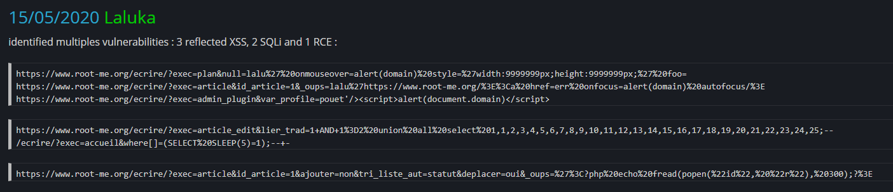

As I wanted the little medal <del>of honor</del> given to Root Me pwners, I started investigating SPIP.

The local test environment was composed of the latest SPIP version (4.1.2 from 20/05/2022), runned by PHP 8.0.0 and MySQL 5.6. "parano" mode activated (anti-XSS).

<div style="page-break-after: always;"></div>

# Stored XSS (+ CSRF and RCE)

You can find details on this part in the report named "SPIP_4.1.2_XSS_Abyss_Watcher_30_06_22.pdf"¨(it's in french sorry :)). They were my first discoveries, and already gave me the right to have the holy medal (and my name in the pwners) : 

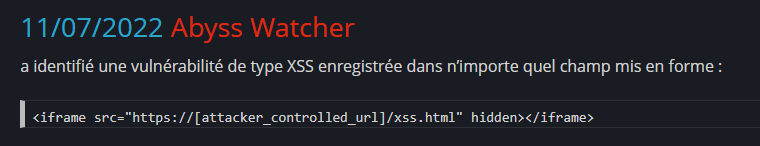  

>Traduction : "*has identified a stored XSS vulnerability in any rendered field*"

I was happy, but it wasn't **enough**. 

<div style="page-break-after: always;"></div>

# Post-Auth RCE

## privileges needed to exploit

You need to have the "author" role, or be able to see articles in the backend.

## work in pair, maximise your chances

As I am not really a bug bounty guy, I asked [SpawnZii](https://www.root-me.org/SpawnZii) (http://yeswefiak.fr:1313/) to join me in my researches. We'll cover more surface and help each other see things that could have been missed. 

## check what have already been done

How could I write these lines without mentioning the work done here by Laluka : https://thinkloveshare.com/hacking/rce_on_spip_and_root_me/. He basically destroyed the scope, by building tools and manually reviewing everything. He pulled out many vulnerabilities (as mentionned earlier), which where all **ｆｉｘｅｄ** at the time we were doing the bounty. Or maybe not :).

## "on est bon, rien a faire"

After many hours trying to exploit via file upload, dns rebinding etc., I decided to read the Laluka article one more time. I noticed this PHP comment in a SPIP commit, which fixed the RCE :

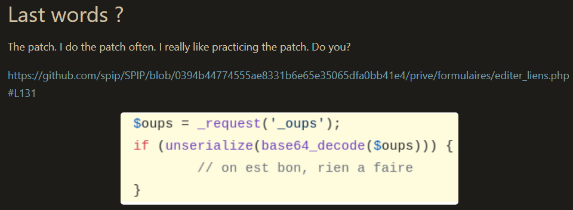  

> Traduction : "**we are good, nothing to do**"

At the instant I saw this text, I knew something was wrong. I felt it in my spine.

<div style="page-break-after: always;"></div>

## debug, try to understand what is going on

The _oups parameter allows to cancel an action, like a miss click on "Remove author" from the "edit_article" page. The previous code can be found in "prive/formulaires/editer_liens.php" :

L133 -> 143 (formulaires_editer_liens_charger_dist) :

```
$oups = _request('_oups') ?? '';
	if ($oups) {
		if (unserialize(base64_decode($oups))) {
			// on est bon, rien a faire
		} elseif (unserialize($oups)) {
			// il faut encoder
			$oups = base64_encode($oups);
		} else {
			$oups = '';
		}
	}
```

We can see that it is checking for the GET parameter "_oups". Let's add some glorious `print_r`, and try to pass the `if`s :

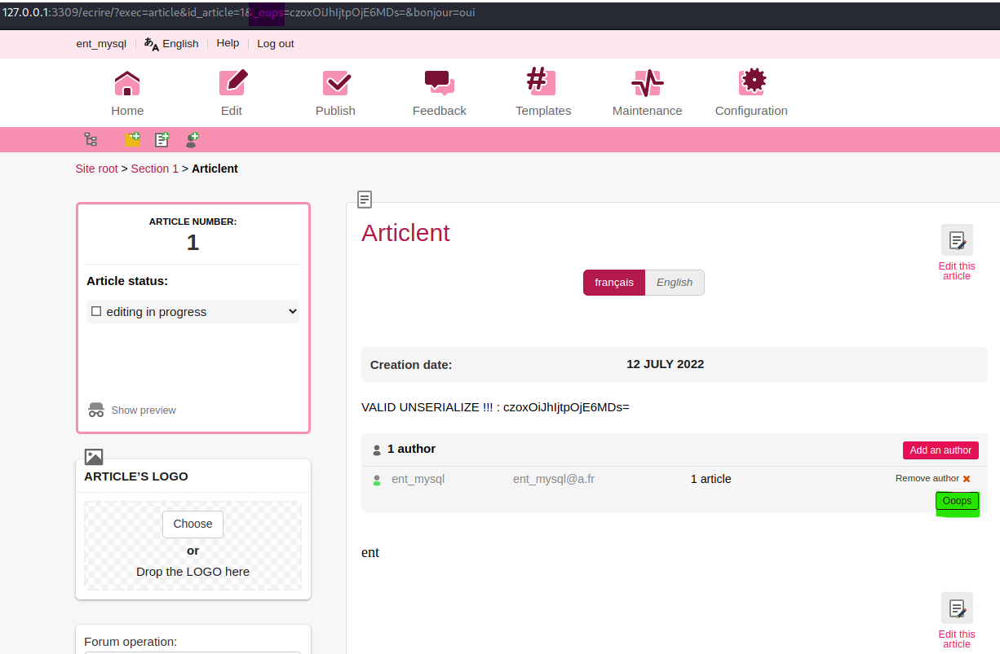  

Well, it was easy. We just needed to pass a valid PHP object encoded in base64 : `'czoxOiJhIjtpOjE6MDs=' : 's:1:"a";i:1:0;'`.  
The value is reflected in an HTML field : 

`<input type="hidden" name="_oups" value="czoxOiJhIjtpOjE6MDs=">`

Yup, yup, yup. Wanna XSS ?

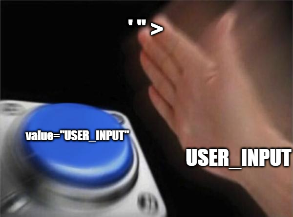 

## quotes everywhere, xss everywhere

Let's inject random quotes and angle brackets `_oups=czoxOiJhIjtpOjE6MDs='">` :

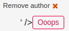  

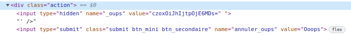  

 

This does not look good, noting that at this point, I didn't even checked what was the rest of the code. The only observation I could make was that the unserialize function only checked if "_oups" started with a valid base_64 object.  

Does it mean that everything after the b64 is processed without restiction ?

<div style="page-break-after: always;"></div>

## investigate a bit

The code here is the end of the function. Let's check with `print_r` what it looks like :
```
$valeurs = [
		'id' => "$table_source-$objet-$id_objet-$objet_lien", // identifiant unique pour les id du form
		'_vue_liee' => $skel_vue,
		'_vue_ajout' => $skel_ajout,
		'_objet_lien' => $objet_lien,
		'id_lien_ajoute' => _request('id_lien_ajoute'),
		'objet' => $objet,
		'id_objet' => $id_objet,
		'objet_source' => $objet_source,
		'table_source' => $table_source,
		'recherche' => '',
		'visible' => 0,
		'ajouter_lien' => '',
		'supprimer_lien' => '',
		'qualifier_lien' => '',
		'ordonner_lien' => '',
		'desordonner_liens' => '',
		'_roles' => $roles, # description des roles
		'_oups' => $oups,
		'editable' => $editable,
	];

	// les options non definies dans $valeurs sont passees telles quelles au formulaire html
	$valeurs = array_merge($options, $valeurs);
	print_r($valeurs);
	return $valeurs;
```

<div style="page-break-after: always;"></div>

Try to render an HTML tag `<b>BOLD ?</b>`: 

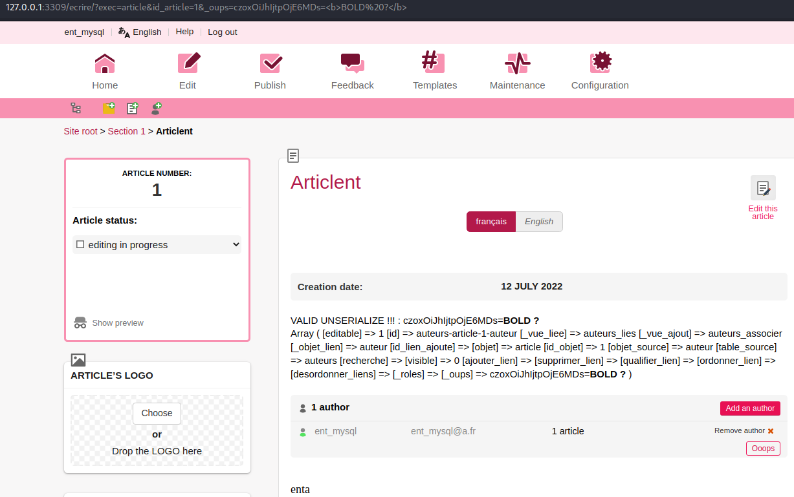  

We can see that the "_oups" value holds our valid base64 object, and everything that comes after. I don't know SPIP enough to explain why this is rendered like that, but my guess is that the "templates" interprets it as if it was valid code passed from the server.

Soooooo ?

<div style="page-break-after: always;"></div>

## _oupsed

Retranscription (screenshot from the conversation with SpawnZii) :

>Dude, I think I found a reflected XSS with this payload :

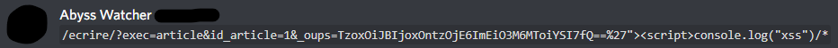  

*45 seconds later* :

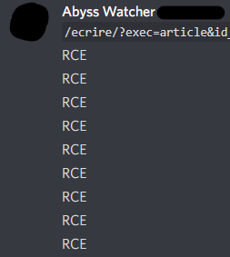  

Well, well, well, what could have happened between those two messages ? 

Hint :

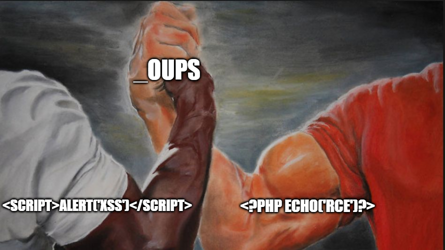

Answer (`_oups=czoxOiJhIjtpOjE6MDs=%27"><?php%20echo(%27RCE%27)?>`) :

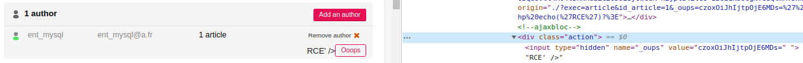  

The php tags are gone, and we can see the letters "R","C","E" kindly appearing on our screen :).

What is happening :

```
if (_request('annuler_oups') and $oups = _request('_oups') and $oups = base64_decode($oups) and $oups = unserialize($oups))
```

So, it first checks for a valid base64_decode, which is true. Then for a valid base64 object, which is also true (the object instantiates a string "a" of length 1) :

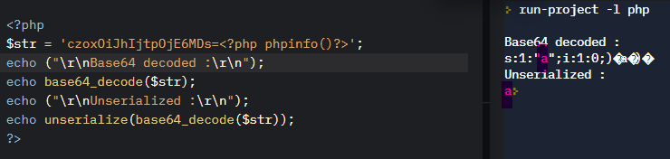 

It considers the user input as valid, and sends it to further processing (dynamic eval engine of SPIP) which renders our code.

We now have the ability to execute arbitrary code on the server, with any author account. A first approach could be to dump the `phpinfo()` to check the disabled functions, then build payloads to exfiltrate files, secrets (e.g. : SQL creds in `config/connect.php`), try to privesc etc.

After this discovery, we decided to create POC's for exploit automation. It is joined in this folder, under the name "SPIP_4.1.2_AUTH_RCE_POC.py". We did not pushed it really far, just an interactive webshell on terminal, with basic error handling.

## be good, report to SPIP

We decided to report the vulnerability to SPIP, because we had no interest into exploiting or selling it. [g0uZ](https://www.root-me.org/g0uZ), foundator of Root Me, is also in charge of the security in SPIP core. They were both quickly capable to fix the issue.

# Conclusion

It was a great experience to work in team with SpawnZii, and being able to make Root Me and SPIP a little more secure is great. We managed to generate two POC, one led to CSRF/RCE via a stored XSS, the other to RCE via logic errors. 

There are certainly still bugs present, but we don't think continuing pentesting it for now.
I hope that you had pleasure to read these lines, and that it motivated into finding exploits (in a white hat way). Also, don't forget to double check your security fixes :).

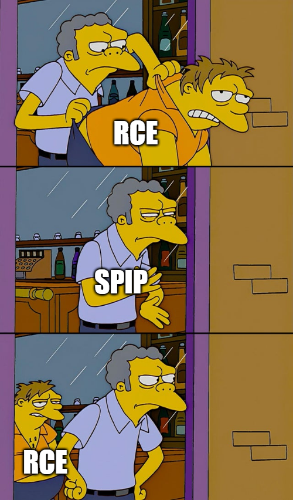 


## Fix :

- https://git.spip.net/spip/spip/pulls/5253

