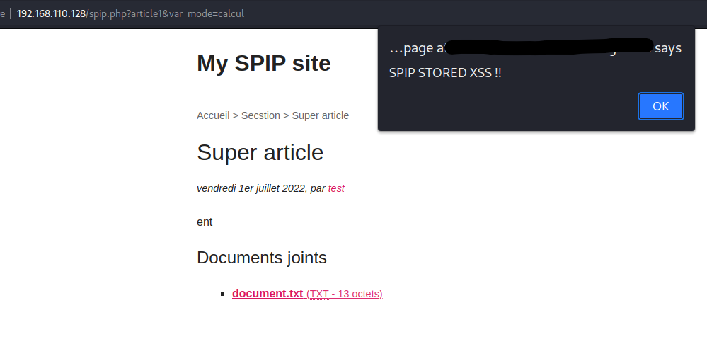

# "XSS Stockée" menant à "CSRF -> RCE"  sur spip 4.1.2

### Auteur : Abyss Watcher

# Environnement

Nous avons déployé spip localement sur notre machine, en téléchargeant la version 4.1.2 depuis ce lien : https://files.spip.net/spip/archives/spip-v4.1.2.zip. Ensuite nous avons instancié plusieurs environnements docker (PHP, mysql). La configuration de spip est celle par défaut, nous avons suivi la procédure sans rien toucher ensuite.

Les failles citées par la suite nécessitent au minimum d'avoir le droit de mettre ou éditer des documents dans les ressources du site.

# XSS stockée sur le portail privé

Pour réaliser l'attaque, il faut en premier lieu mettre en ligne un fichier (via n'importe quelle "box" d'upload) :

  

Une fois cela fait, nous cliquons sur "Modifier", puis insérons le payload suivant dans les crédits `<iframe src="https://[attacker_controlled_url]/xss.html">` :

  

En accédant à n'importe quel endroit où le document est référencé avec les crédits (article, liste de documents...), la balise `iframe` est rendue sur la page :

  

Ici, nous faisons apparaître une alerte assez grossière, mais un payload bien pensé serait indétectable à l'utilisateur.

# Latéralisation de la XSS stockée sur le portail public

Nous pouvons désormais simplement créer un article, et joindre notre document malveillant. En visionnant l'article sur le site public :

  

Lors de nos recherches, nous avons également découvert que le titre de l'article était vulnérable :

  

Ici, le sanitizer détecte bien le code malveillant, en revanche, sur le site public :

  

Le code se déclenche sur la page d'accueil, dès que le titre de l'article est mentionné.

Nous avons donc affaire à une vulnérabilité plutôt critique, permettant d'obtenir toute sorte d'informations sur l'utilisateur, générer des pages de phishing etc.

Après plusieurs investigations, il est possible d'injecter ce payload dans le **nom des sections** également. 

Des payloads tels que `` peuvent également être rendus en tant que noms d'articles ou de sections sur les portails privés et publics :

XSS section :

  

XSS article :

  

Preuve :

  

**NB :** Après lecture de l'article https://www.spip.net/en_article4948.html, il semblerait que le mode "parano anti-XSS" ne soit pas actif post-installation. Néanmoins, nous trouvons cela relativement étrange de permettre le rendu de code HTML sans aucune restriction par défaut, facilitant les attaques sur des sites tenus par des utilisateurs souvent étrangers à la cybersécurité. Cela explique néanmoins le fait que des payload XSS si simples passent dans des champs aussi importants.

Après activation du mode parano, les payload "faciles" type `` ne sont plus rendues. Ce n'est malheureusement pas le cas du bypass via `<iframe>`.

# POC : XSS Stockée -> CSRF -> RCE 

Eléments obligatoires pour parvenir à une RCE :
- Un webmaster doit visiter la page contenant la XSS, ou un utilisateur ayant le droit d'upload des plugins
- Le dossier `plugins/auto` doit exister à la racine de spip

## Via l'espace privé et public - mode "parano" ON :

spip autorise l'upload de plugins zippés par les utilisateurs en ayant la permission. Ces derniers peuvent donc contenir du code PHP, accessibles par la suite depuis la racine du site. Le seul payload que nous avons pu trouver est basé sur `<iframe>`. Cependant, il n'est pas possible de le faire fonctionner via une ressource externe, à cause des CORS :

> Le Cross-Origin Resource Sharing ou CORS est un mécanisme qui permet à des ressources restreintes d'une page web d'être récupérées par un autre domaine extérieur au domaine à partir duquel la première ressource a été servie.    

source : https://fr.wikipedia.org/wiki/Cross-origin_resource_sharing

Un `<iframe>` permet de charger une page externe et de l'afficher dans un conteneur. Néanmoins, pour contrer les attaques, il n'est pas possible d'accéder du conteneur à un autre site si ce dernier ne l'a pas explicitement accordé (en-tête de réponse "Access-Control-Allow-Origin" obligatoire sur la ressource distante). 

Pour contourner ce problème, nous avons utilisé la possibilité de mettre en ligne des fichiers HTML dans les documents du site. Evidemment, si un utilisateur dispose des droits pour partager des documents, il est censé ne pas injecter de documents malicieux (utilisateur mature). Dans le cas contraire, il est tout de même nécessaire à un webmaster de visiter explicitement le document, via le lien complet, pour être vulnérable :

  

Cela réduit donc grandement les chances de compromission, étant donné que ce dernier prendra en général des précautions (en théorie) avant de cliquer sur un document HTML.

---

La possibilité de mettre directement en ligne un fichier contenant notre payload javascript permet de "contourner" les CORS. En effet, lorsque notre XSS se déclenchera, la source du conteneur `<iframe>` ne pointera plus vers `https://[attacker_controlled_url]/` mais `https://[spip_url]/`. Sa source et celle de l'hôte seront alors identiques. Il n'y a donc plus de "cross origin requests", le conteneur peut accéder normalement aux ressources du site. La CSRF peut ainsi être exécutée via un article, comme précédemment, mais également sur l'espace privé.

Préparatifs de l'attaque :

* Mise en ligne d'un document HTML contenant le code javascript malveillant (voir capture précédente)
* Deux choix :
  - Injecter directement le payload `<iframe src="/IMG/html/xss.html" hidden></iframe>` dans le champ "Crédits" du document HTML
  - Attendre quelque temps que le document HTML malicieux ne soit plus en tête de liste des documents récents, puis mettre en ligne un autre document (ex: une image `logo_site.jpg`) et injecter le payload `<iframe src="/IMG/html/xss.html" hidden></iframe>` dans le champ "Crédits" du document

Déroulement de l'attaque :

- Le webmaster visite la page contenant la XSS ("/ecrire/?exec=documents", "/ecrire/?exec=popin-choisir_document", un article lié à ce document etc.), qui cette fois-ci exploite une faille de l'espace privé contournant le sanitizer. 
- Notre script malveillant est chargé
- Le script récupère un token CSRF sur la page `/ecrire/?exec=charger_plugin`
- Le script poste le formulaire d'upload de plugin avec le token CSRF sur la page `/ecrire/?exec=charger_plugin`
- Le plugin zippé est récupéré sur le net par spip, et est copié dans le chemin `plugins/auto`
- Le script fait une requête sur `/plugins/auto/[nom_plugin]/[nom_webshell].php`, avec la commande à exécuter
- Le résultat de la commande est contenu dans la réponse HTTP

Le POC est joint dans ce dossier sous le nom "SPIP_4.1.2_POC_CSRF_RCE.js".

Nous exécutons les commandes `ls -la; rm -rf ../[plugin_name]`, permettant de lister le contenu du dossier courant et d'effacer la présence du plugin. Voici le résultat d'une visite du webmaster :

  

Vous pouvez voir en bas, dans la console, que nous avons bien exfiltré le résultat de la commande, prouvant son exécution. Le dossier "spip/plugins/auto" est redevenu vide. 

Il est donc évidemment possible d'instancier un "reverse shell", ou de supprimer ses traces dans les logs via une élévation de privilèges par exemple.

**Défaut de cette attaque** : Il est nécessaire de mettre en ligne un document HTML. Néanmoins, il est très facile de cacher le code malveillant à l'intérieur.

**Avantages non-négligeables**  : Payload invisible et fonctionnel sur l'espace privé et public. Les seuls moyens de débusquer le payload sont en éditant directement le document, ou en inspectant le code source.

---

**Les possibilités de payload sont infinies (changement de mot de passe, suppression de compte, création d'un webmaster, backdoor, phishing etc.).**

# Remarques

- Afficher une version non-interprétée d'un document HTML lors de son accès via lien direct (ex: `/IMG/html/document.html`). Cela permet de s'assurer du contenu de ce dernier (pas de balises `<script>` ou code malveillant), avant de le rendre (via un bouton "Voulez-vous afficher le rendu de ce document HTML ?"). Cela empêcherait les attaques directes de type XSS, ainsi que le chargement de scripts en local comme pour le POC "XSS -> CSRF -> RCE" détaillé précédemment. En général, l'accès à une ressource locale de manière brute ne pose pas de problèmes (fichiers images, PDF, etc.), mais pas dans ce cas de figure. L'usage d'une sandbox pour rendre ces documents est également envisageable.
  
- Demander une confirmation par mot de passe, au moment de mettre en ligne un plugin, créer un webmaster... Cela bloquerait (en partie) les vecteurs de RCE et d'élévation de privilèges.

# Fixes

CSP to block iframes : https://git.spip.net/spip/spip/pulls/5254  
Block XMLHttpRequest CSRF on critical actions : https://git.spip.net/spip/spip/pulls/5256  
Function to ask for a password before critical actions : https://git.spip.net/spip/spip/pulls/5249
